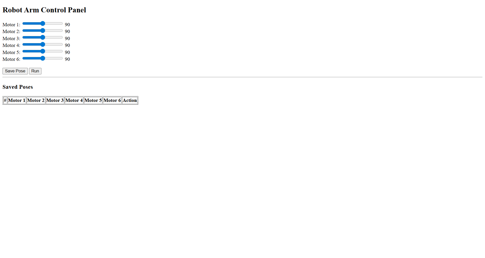
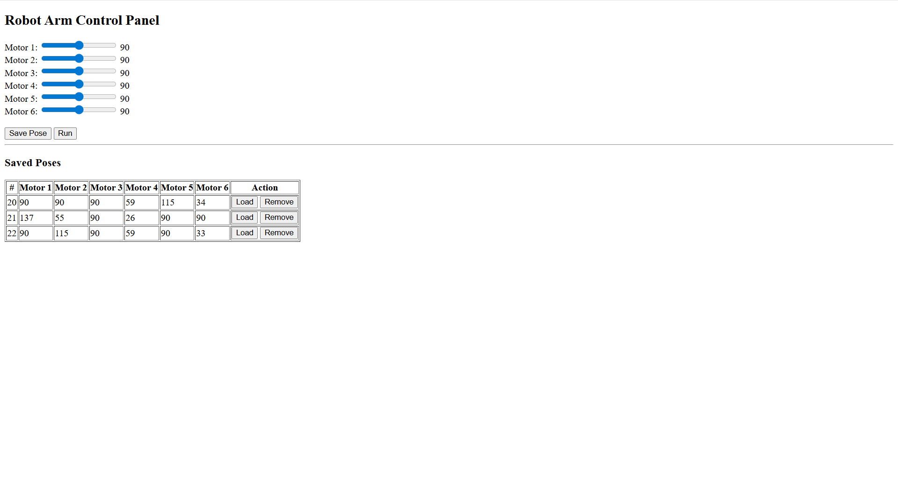
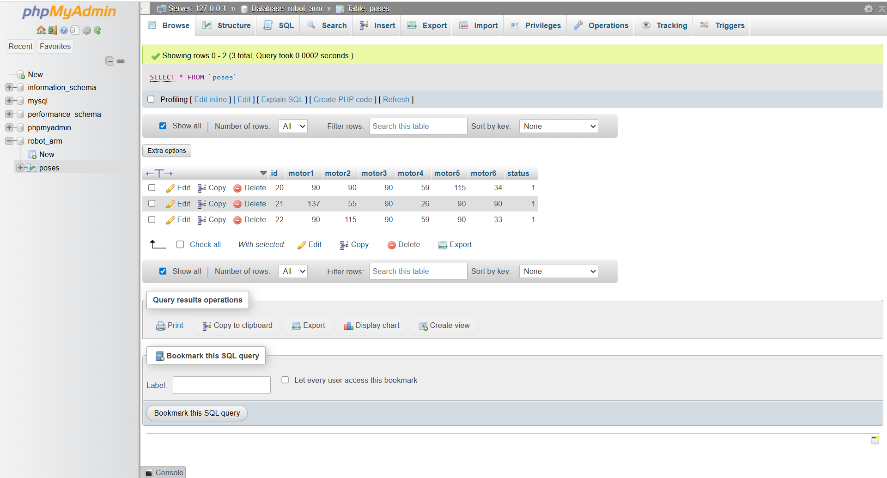

# Robot Arm 

This project is a simple web application to manage and control robot arm poses. It stores poses in a MySQL database, fetches a random active pose, and can update all poses’ status to inactive.

## Features
- Fetch a random robot arm pose with status = 1
- Update all poses to set status = 0
- Simple web interface using HTML, CSS, JavaScript, and PHP
- MySQL database integration

## Screenshots

### Main Interface:

### Update Status Action:

### Poses Table (phpMyAdmin):

